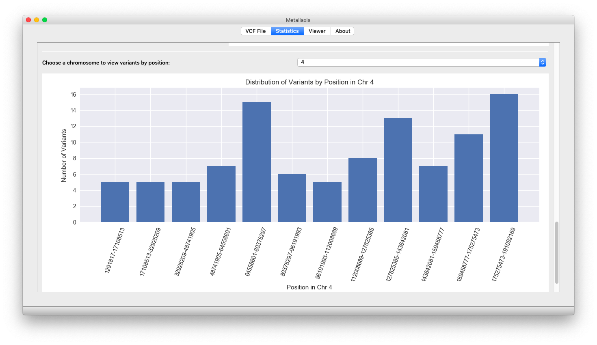
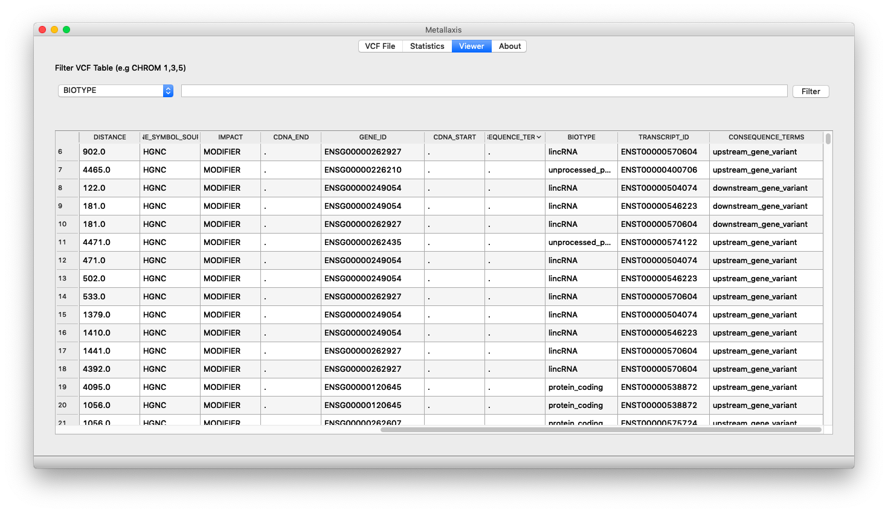
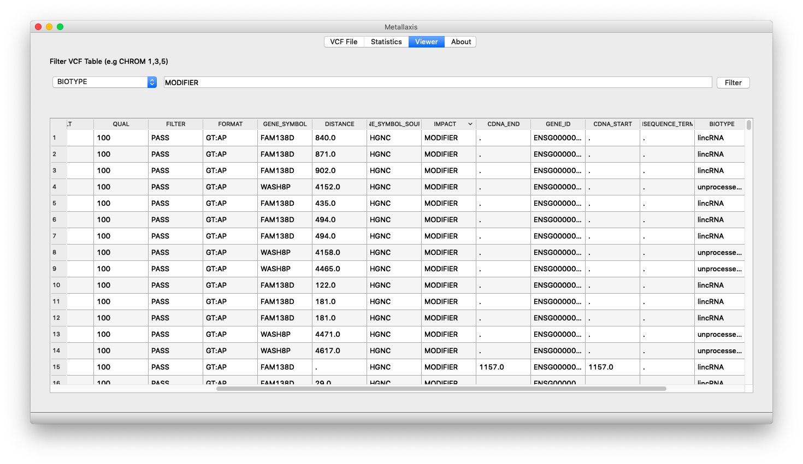

[](https://snyk.io/test/github/SL-LAIDLAW/Metallaxis?targetFile=requirements.txt)
[](https://codeclimate.com/github/SL-LAIDLAW/Metallaxis/maintainability)
[](https://metallaxis.readthedocs.io/en/latest/?badge=latest)
[](https://badge.fury.io/py/Metallaxis)

[](https://www.python.org/downloads/release/python-360/)
[](https://www.gnu.org/licenses/gpl-3.0)

# Metallaxis

Metallaxis is a Python graphical interface for viewing and annotating VCF
files. On loading a VCF file or compressed variant (vcf.gz,vcf.xz) it will make
an API call to EMSEMBL's [VEP](https://www.ensembl.org/vep) with the IDs of the
VCF.

On the interface basic statistics and graphs are displayed in the
statistics pane, and a Table pane is also avaliable on which variants can be
filtered by data from VCF, from annotation, or parsed form the INFO column.

## Features
- INFO column splitting into columns that can be sorted
- Filtering of all VCF columns
- Automatic annotation from VEP (provided VCF is human)
- Automatically generated statistics and graphs
- Savable analysis as a HDF5 data store

## Authors
Sean Laidlaw & Qiqi He

## Requirements:
Python:
- Python 3.6

Libraries
- python-magic : 0.4.15
- pandas : 0.23.4
- numpy : 1.15.4
- tables : 3.4.4
- PyQt5 : 5.11.2
- requests : 2.20.1
- matplotlib : 3.0.2


## Installation

### Pip
Use the package manager [pip](https://pip.pypa.io/en/stable/) to install
Metallaxis.

```bash
pip install Metallaxis
```

### From Source
Metallaxis can also be installed from source, by running a git clone and then
running the make file which will install dependancies and install as a python
module.

```bash
git clone https://github.com/SL-LAIDLAW/Metallaxis
cd Metallaxis && make
```


## Usage
To open the GUI and get started, run Metallaxis as a module:
```bash
python3 -m metallaxis
```

It can also be run directly on a VCF file:
```bash
python3 -m metallaxis ../samples/1000_genomes_extract.vcf.gz
```

Or to load a previously saved Metallaxis session, by using the saved HDF5 as
argument:
```bash
python3 -m metallaxis ../saves/big_saved_analysis.h5
```


## Screenshots

Changing the Species to "Human" in the Settings window allows you to check "Annotate Variants", meaning that the next loaded file will have its IDs sent to be annotated from the VEP API. 


Example variant data displaying statistics of variants by chromosome, types of variants, and averages. As well as number of variants by position for each chromosome.



Example variant data with VEP annotation listing consequence terms, biotype, gene id, impact, etc. for some of our variants.



Example data showing off filtering ability of _Metallaxis_, not just limited to normal VCF columns but works equally well on recently obtained annotation columns:




## TODO
1. Rewrite API request to retry in case of server error
1. Generate statistics off of annotation data
1. Write documentation to be generated by Sphinx
1. Split \_\_main__ into separate files for easy importing and readability
1. Optimise writing annotation data to HDF5 to reduce performance bottleneck
1. Add secondary annotation to get ontology and phenotype information


## Contributing
Pull requests are welcome. For major changes, please open an issue first to discuss what you would like to change.

## License
[GPLv3](https://choosealicense.com/licenses/gpl-3.0/)
